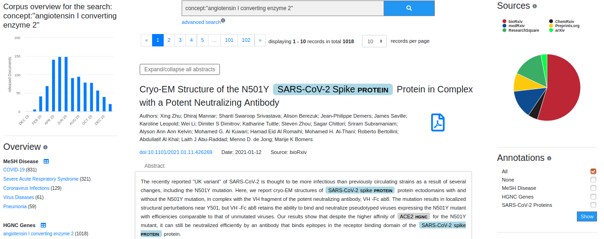

# COVID-19 preVIEW: Customized Semantic Search to Explore COVID-19 Research Preprints

preVIEW is a COVID-19 related search engine which can be accessed under [https://preview.zbmed.de](https://zbmed.preview.de).  
In this repository, we provide further information about our methodologies, i.e. data acquisition and the Named Entity Recognition tools. 

## Data Sources

It currently contains preprints from six different preprint servers, namely bioRxiv, medRxiv, ResearchSquare, arXiv and preprints.org. For all preprint server, we are using specific API calls to retrieve the metadata. Therefore, we developed specific search queries that can be seen in the following. 

Server | Query/Api
:----- | :---- 
ChemRxiv   | covid:keyword: sars-cov-2 OR :keyword: corona OR :keyword: covid-19 OR :keyword: coronavirus
Researchsquare  | abstract=covid sars ncov coronavirus coronaviruses&postedAfter=2020-01-01
aRxiv | order: -announced_date_first; size: 200; date_range:from 2020-01-01 ; include_cross_list: True; terms:AND title=COVID 19; OR abstract=COVID 19; OR title=sars cov 2; OR abstract=sars cov 2; OR title=coronavirus; OR abstract=coronavirus
Preprints.org | search1=covid-19&field1=title_keywords&clause=OR&search2=sars cov-2&field2=title_keywords&matchType=exact&date_from=2020-01-01
bioRxiv & medRxiv | [https://api.biorxiv.org/covid19/0](https://api.biorxiv.org/covid19/0)

## Text Mining

To allow for semantic searches, we included a text mining pipeline. We apply machine learning methods to annotate genes and diseases (GNormPlus [1] and TaggerOne [2]). As we
 realized a lack in COVID-19 related terms, we implemented a Python-based post-processing step. The corresponding script can be found [here](post-processing) including some example data.
Moreover, we use ConceptMapper [3] to annotate SARS-CoV-2 proteins. Therefore, we manually created a terminology that can be found [here](terminology). In addition, evaluation data for all three entity classes has been manually curated by two domain experts, which we provide [here](data).

[1] Wei C-H, Kao H-Y, Lu Z. GNormPlus: An Integrative Approach for Tagging Genes, Gene Families, and
Protein Domains [Internet]. Vol. 2015, BioMed Research International.  
[2] Leaman R, Lu Z. TaggerOne: joint named entity recognition and normalization with semi-Markov Mod-
els. Bioinformatics. 2016 Sep 15;32(18):2839–46.  
[3] Funk C, Baumgartner W, Garcia B, Roeder C, Bada M, Cohen KB, et al. Large-scale biomedical concept
recognition: an evaluation of current automatic annotators and their parameters. BMC Bioinformatics.
2014 Feb 26;15(1):59.

## Citation 

@incollection{langnickel_covid-19_2021,  
    title = {{COVID}-19 {preVIEW}: Semantic Search to Explore {COVID}-19 Research Preprints},  
	isbn = {978-1-64368-184-9 978-1-64368-185-6},  
	url = {https://ebooks.iospress.nl/doi/10.3233/SHTI210124},  
	shorttitle = {{COVID}-19 {preVIEW}},  
	abstract = {During the current {COVID}-19 pandemic, the rapid availability of profound information is crucial in order to derive information about diagnosis, disease trajectory, treatment or to adapt the rules of conduct in public. The increased importance of preprints for {COVID}-19 research initiated the design of the preprint search engine {preVIEW}. Conceptually, it is a lightweight semantic search engine focusing on easy inclusion of specialized {COVID}-19 textual collections and provides a user friendly web interface for semantic information retrieval. In order to support semantic search functionality, we integrated a text mining workflow for indexing with relevant terminologies. Currently, diseases, human genes and {SARS}-{CoV}-2 proteins are annotated, and more will be added in future. The system integrates collections from several different preprint servers that are used in the biomedical domain to publish non-peer-reviewed work, thereby enabling one central access point for the users. In addition, our service offers facet searching, export functionality and an {API} access. {COVID}-19 {preVIEW} is publicly available at https://preview.zbmed.de.},  
	booktitle = {Studies in Health Technology and Informatics},  
	publisher = {{IOS} Press},  
	author = {Langnickel, Lisa and Baum, Roman and Darms, Johannes and Madan, Sumit and Fluck, Juliane},  
	urldate = {2021-05-31},  
	date = {2021-05-27},  
	doi = {10.3233/SHTI210124},  
}

