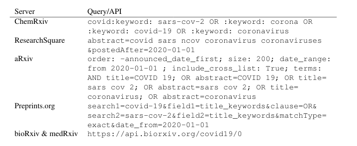

# COVID-19 preVIEW: Customized Semantic Search to Explore COVID-19 Research Preprints

preVIEW is a COVID-19 related search engine which can be accessed under [https://preview.zbmed.de](https://zbmed.preview.de). 

## Data Sources

It currently contains preprints from six different preprint servers, namely bioRxiv, medRxiv, ResearchSquare, arXiv and preprints.org. For all preprint server, we are using specific API calls to retrieve the metadata. Therefore, we developed specific search queries that can be seen in the following. 

 

## Text Mining

To allow for semantic searches, we included a text mining pipeline. We apply machine learning methods to annotate genes and diseases (GNormPlus [1] and TaggerOne [2]). As we realized a lack in COVID-19 related terms, we implemented a Python-based post-processing step. The corresponding script can be found [here](post-processing) including some example data.
Moreover, we use ConceptMapper [3] to annotate SARS-CoV-2 proteins. Therefore, we manually created a terminology that can be found [here](terminology). In addition, evaluation data for all three entity classes has been manually curated by two domain experts, which we provide [here](data).

[1] Wei C-H, Kao H-Y, Lu Z. GNormPlus: An Integrative Approach for Tagging Genes, Gene Families, and
Protein Domains [Internet]. Vol. 2015, BioMed Research International.  
[2] Leaman R, Lu Z. TaggerOne: joint named entity recognition and normalization with semi-Markov Mod-
els. Bioinformatics. 2016 Sep 15;32(18):2839–46.  
[3] Funk C, Baumgartner W, Garcia B, Roeder C, Bada M, Cohen KB, et al. Large-scale biomedical concept
recognition: an evaluation of current automatic annotators and their parameters. BMC Bioinformatics.
2014 Feb 26;15(1):59.

## Citation 

